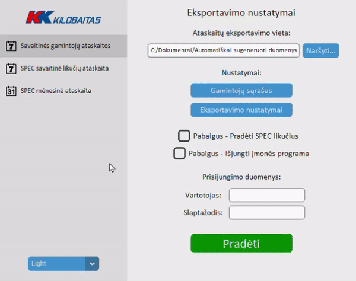
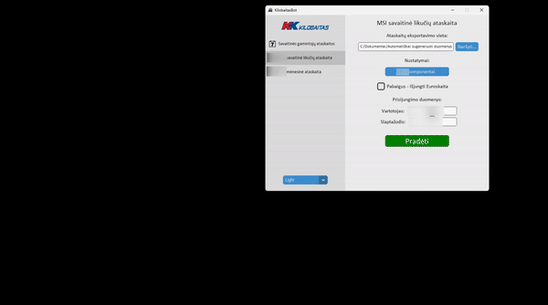

# KilobaitasBOT description

KilobaitasBOT is used to save time by automating repetetive tasks with a lacking legacy software. In total KilobaitasBOT saves 48 hours of boring work every month for an employee.

Since the legacy software has no API, it was created mostly using Pywinauto, Pyautogui, Openpyxl, Selenium libraries for automation and Tkinter library for GUI. Ideally we use pywinauto to connect to the backend and go from there, but in some cases Pyautogui library for image recognition was necessary.

There is three integrated modules so far that do different tasks, the user can freely change the options in these modules, for example if he would like to gather a new manufacturer's data or adding a new type of Graphics Card to filter out in the software. The user could change the settings and the information would be saved to JSON.

KilobaitasBOT workflow:

1. The user changes the settings as he sees fit, and writes down the login information for the legacy software so that KilobaitasBOT could copy-paste it directly to the software itself.

2. When launched one of the modules, KilobaitasBOT at first checks it's initial enviroment, how many monitors are connected, language settings, legacy software version, if there's any programs working that interferes with the autoamtion process, and so on. The software adjusts itself for the enviroment or stops the sequence if there's some kind of error.

3. After the initial phase, KilobaitasBOT will login into the legacy software and does the repetitive tasks depending on the module selected.

4. After extracting necessary data from the software, KilobaitasBOT continues to create and finalize reports with Excel so it could be used for the company's own needs, or sent to company's partners.

